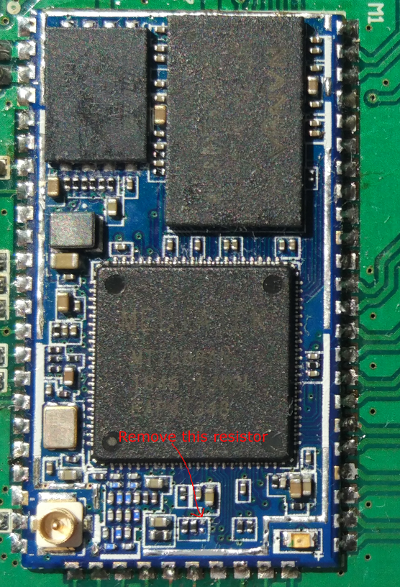

# ZBGW IoT uboot
============================

 
The UBoot bootloader source code for the ZBGW IoT board based on HLK-7688 module.
 

The board layout/schematic can be found on: 
https://circuitmaker.com/Projects/Details/Andrzej-Gendek/ZBGW

The HLK-7688 module is strapped (configured) to boot in 3-byte addressing mode. This can hang board when rebooting while flash is switched to 4-byte mode.
To solve this flash should be configured to power up in 4-byte mode and MT7688 booting also strapped to 4-byte addressing mode.
The following moddifications are needed:
- remove pull down 4.7k resistor from HLK7688 module (see picture for location of this resistor)
- add pull up resistor (10k) on CS1 pin - this will change boot mode to 4b addressing
- program non volatile ADP bit in status register 3 - this will power up flash chip in 4b addressing mode (use "spi sr3 write" command)

After this modifications you can reboot board at any moment and by pressing reset button.

# Compile

Start by cloning the tree

`git clone https://github.com/agendek78/linkit-smart-7688-uboot.git`

To compile this code you need MIPSel toolchain. You can build it from sources
using buildroot. I used GCC 5.7.

When you have cros-compiler ready, simple do:  

`make CONFIG_CROSS_COMPILER_PATH=path to the bin dir of the mips GCC crosscompiler`

Notes: Uboot firmware is uboot.bin NOT uboot.img
